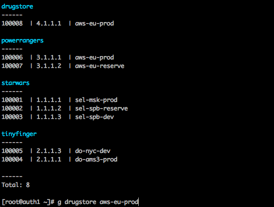

# isolate

[](https://travis-ci.org/itsumma/isolate)
[](https://gitter.im/isolate_bastion/Lobby)



bastion host setup scripts.

## Supports

* [OTP](https://en.wikipedia.org/wiki/One-time_password) (counter and time based) 2FA algorithms
* SSH sessions logging

## Requirements

* Fresh CentOS 7+ setup
* [Ansible](http://docs.ansible.com/ansible/intro_installation.html) for
install or update

## INSTALL

edit `ansible/hosts.ini` and run:
```
cd ansible
ansible-playbook main.yml
```

and restart server
```
# reboot
```

append to `/etc/bashrc`
```
if [ -f /opt/auth/shared/bash.sh ]; then
    source /opt/auth/shared/bash.sh;
fi
```

append to `/etc/sudoers` or use `visudo`
```
%auth ALL=(auth) NOPASSWD: /opt/auth/wrappers/ssh.py
```

### SSH
edit `/etc/ssh/sshd_config`:
```
# AuthorizedKeysFile /etc/keys/%u_authorized_keys
PermitRootLogin without-password
PasswordAuthentication yes
GSSAPIAuthentication no
AllowAgentForwarding no
AllowTcpForwarding no
X11Forwarding no
UseDNS no
MaxStartups 48:20:300
TCPKeepAlive yes
ClientAliveInterval 36
ClientAliveCountMax 2400
```

```
systemctl restart sshd
systemctl status sshd
```

### OTP
append to `/etc/pam.d/sshd`
```
auth    required    pam_oath.so usersfile=/etc/oath/users.oath window=20 digits=6
```

Example:
```
auth    required    pam_sepermit.so
auth    substack    password-auth

auth    required    pam_oath.so usersfile=/etc/oath/users.oath window=20 digits=6

auth    include     postlogin
```

```
sed -i -e 's/ChallengeResponseAuthentication no/ChallengeResponseAuthentication yes/g' /etc/ssh/sshd_config
```
append to `/etc/ssh/sshd_config`

```
Match Group auth
    AuthenticationMethods keyboard-interactive
```
```
systemctl restart sshd
systemctl status sshd
```

## Management

#### load auth environment
```
# source /opt/auth/shared/bash.sh;
```

#### add user
```
# auth-add-user username
```

#### generate otp
```
# Time-Based (Mobile and Desktop apps)
gen-oath-safe username totp

# Counter-Based (Yubikey and Mobile apps)
gen-oath-safe username hotp

# and append user secret to /etc/oath/users.oath
# Example: HOTP username - d7dc876e503ec498e532c331f3906153318ec565
```

### Data sources

append to `/etc/bashrc`
```
ISOLATE_BACKEND=redis; # or zabbix
export ISOLATE_BACKEND;
```

#### Redis

```
ISOLATE_REDIS_HOST="127.0.0.1";
ISOLATE_REDIS_PORT="6379";
ISOLATE_REDIS_DB=0;
ISOLATE_REDIS_PASS="te2uth4dohLi8i"; # /etc/redis.conf
export ISOLATE_REDIS_HOST;
export ISOLATE_REDIS_PORT;
export ISOLATE_REDIS_PASS;
export ISOLATE_REDIS_DB;
```

#### Zabbix

```
ISOLATE_ZABBIX_URL="http://zabbix.95.213.200.160.xip.name"
ISOLATE_ZABBIX_USER="isolate"
ISOLATE_ZABBIX_PASS="aZ1eil2ooz4Iefah"
export ISOLATE_ZABBIX_URL;
export ISOLATE_ZABBIX_USER;
export ISOLATE_ZABBIX_PASS;
```


#### add server
```
$ auth-add-host --project starwars --server-name sel-msk-prod --ip 1.1.1.1
Database updated
```

#### del server
```
$ auth-del-host <server_id>
```

#### test data
```
auth-add-host --project starwars --server-name sel-msk-prod --ip 1.1.1.1
auth-add-host --project starwars --server-name sel-spb-reserve --ip 1.1.1.2
auth-add-host --project starwars --server-name sel-spb-dev --ip 1.1.1.3

auth-add-host --project tinyfinger --server-name do-ams3-prod --ip 2.1.1.1
auth-add-host --project tinyfinger --server-name do-nyc-dev --ip 2.1.1.3

auth-add-host --project powerrangers --server-name aws-eu-prod --ip 3.1.1.1
auth-add-host --project powerrangers --server-name aws-eu-reserve --ip 3.1.1.2

auth-add-host --project drugstore --server-name aws-eu-prod --ip 4.1.1.1 --port 25 --user dealer --nosudo

# Host with SSH proxy

## add proxy
auth-add-host --project bigcorp --server-name au-prod-bastion --ip 45.45.45.45 --port 2232
Database updated: 10001

# and use this id (10001) as proxy to other hosts

## add hosts in network
auth-add-host --project bigcorp --proxy-id 10001 --server-name au-prod-web1 --ip 192.168.1.1
auth-add-host --project bigcorp --proxy-id 10001 --server-name au-prod-web2 --ip 192.168.1.2
auth-add-host --project bigcorp --proxy-id 10001 --server-name au-prod-web3 --ip 192.168.1.3

```


### Road Map

* Kibana logging
* Hosts storage plugins (redis, mongo, 24mon)
* ZSH support
* Web-Hooks
* Zabbix support
* NewRelic support
* CI
* GeoIP ASN lookup
* SELinux Support
* [Ideas?](mailto:ilya.yakovlev@me.com)
